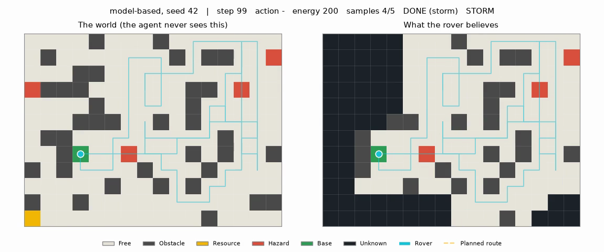
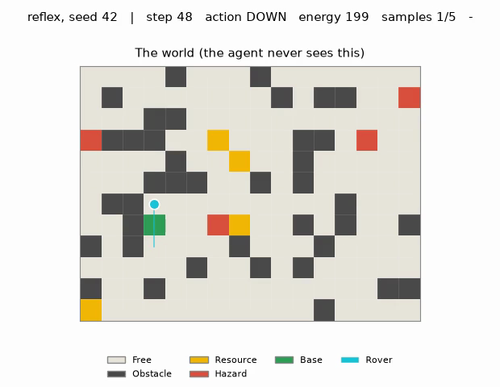
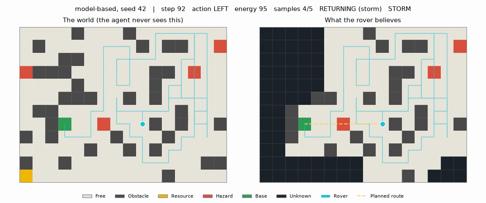

<h1 align="center">🛰️ Rover Sim</h1>

<p align="center">
  <b>An exploration rover that maps an unknown world, then finds its own way home.</b>
</p>

<p align="center">
  
  
  
  
</p>

<p align="center">
  
</p>

<p align="center">
  <sub><b>Left:</b> the world. <b>Right:</b> what the rover believes. It came home during a storm with
  4 of 5 samples — the fifth (gold, bottom-left) sits in a region it never explored.</sub>
</p>

---

## Quick start

```bash
uv sync

uv run python -m rover_sim.cli show-map --seed 42           # look at a world
uv run python -m rover_sim.cli run --seed 42 --show-belief  # run the agent
uv run python -m rover_sim.cli run --seed 42 --animate      # ...and film it
```

Every run writes `runs/<policy>-seed<n>/` containing `trajectory.csv`, `summary.json`, and
`trajectory.mp4` if you asked for it.

---

## The environment

A 12×16 grid. Five cell types plus `UNKNOWN`, which **only ever appears in an agent's belief map** —
never in the true world.

```
. . . . # . . . # . . . . . . .      .  free          #  obstacle
. # . . . . . . . # . # # . . !      *  resource      !  hazard
. . . # # . . . . . . . . . . .      R  rover         B  base
! # # # . . * . . . # # . ! . .
. . . . # . . * . . # . . . . .      seed 42
. . . # # # . . # . # . . . . .
. # # . . . . . . . . . . . . .
. . # R . . ! * . . # . # . . #
# . # * . . . # . . . # . . . .
. . . . . # . . # . # . . . . .
# . . # . . . . . . . . . . # #
* . . . . . . . . . . # . . . .
```

Maps are **generated, not hand-drawn**, and every map is validated before use: a breadth-first
search from base must reach every resource, or the layout is thrown away and redrawn. Without that
check, a seed could silently produce an impossible mission and make the results meaningless.

The world also has **energy** (1 per move, 3 to enter a hazard, doubled during a storm, full
recharge at base) and **storms**, which begin at random after step 30 and never stop.

> [!IMPORTANT]
> **The one rule everything else follows:** the environment owns the true state of the world; the
> agent owns only its beliefs. A policy never reads environment internals — only what `reset()` and
> `step()` hand back. `_get_info()` exists for logs and tests and is off-limits to agents.

## What the rover can sense and do

**Actions** — `UP` `DOWN` `LEFT` `RIGHT` `COLLECT` `WAIT`.

**Sensors** — the observation is assembled from these five and nothing else, so everything the agent
is permitted to know sits in one place:

| Sensor | Returns | Note |
|---|---|---|
| `_sense_local()` | 3×3 view around the rover | **This is the partial observability.** Off-grid reads as `OBSTACLE` — truthful, since the rover cannot go there |
| `_read_position()` | `(row, col)` | odometry |
| `_read_energy()` | battery level | |
| `_count_samples()` | samples carried | *not* how many exist — see [Results](#results) |
| `_sense_weather()` | storm, yes or no | |

## Internal state

A **simple reflex agent** picks its action from the current percept alone. It cannot tell "I have
been here" from "this is new", so identical percepts produce identical moves and it paces between
two cells forever:

<p align="center">
  
</p>

<p align="center"><sub><b>48 steps. Three cells.</b> This is what having no memory looks like.</sub></p>

The model-based agent fixes it by carrying state between steps:

```python
belief_map: np.ndarray        # starts all UNKNOWN, filled in from local_view
visited: set[Coord]           # where I have been
last_action: int | None       # what I just did
mode: "EXPLORING" | "RETURNING" | "DONE" | "FAILED"
trajectory: list[Step]        # what I remember doing
```

`update_state(obs)` runs once per percept and merges **two different kinds of knowledge**:

<table>
<tr><th width="50%">🧭 Transition model</th><th width="50%">📡 Sensor model</th></tr>
<tr valign="top"><td>

*"If I did X, the world should now look like Y."*

I asked to move `UP`, so I expect to be one row higher. If odometry says I did **not** move, then
the cell above me is blocked.

**I have learned something I never sensed** — knowledge derived from acting and remembering. A
memoryless agent can never do this, because it has nothing to compare against.

</td><td>

*"This percept means the world is like Y."*

The 3×3 `local_view` is ground truth about nine cells. Translate view coordinates into map
coordinates and paste it into the belief map.

Straightforward copying — but it is only useful **because there is somewhere to keep it**.

</td></tr>
</table>

Exploration then ranks each neighbouring cell by `(visit_count, is_hazard, −unknown_neighbours)`,
lowest wins, ties broken randomly. The first number alone kills the oscillation: standing somewhere
makes it less attractive than its neighbours, so the rover is pushed outward automatically.

<p align="center">
  
</p>

<p align="center"><sub>Mid-run. The dark region on the right is everything the rover has not seen yet.</sub></p>

## Explore, then come home

```
EXPLORING ──────► RETURNING ──────► DONE
     │
     └──────────► FAILED   (battery flat)
```

Three conditions send the rover home, checked in this order and **re-evaluated from scratch every
step** — never latched on a single reading, because the route home shortens as the map fills in and
a storm doubles its cost mid-journey:

| Trigger | Condition | Try it |
|---|---|---|
| 🗺️ **survey complete** | no reachable resource **and** no frontier cell left | `--seed 5 --storm-prob 0 --max-energy 4000 --max-steps 1200` |
| 🌩️ **storm** | direct percept | `--seed 11` |
| 🔋 **energy margin** | `energy ≤ trip_cost × 1.3` | `--seed 3 --storm-prob 0 --max-energy 60` |

```
outcome: mission complete (went home: survey complete)     # seed 5
steps: 189   samples: 5/5   map known to the agent: 192/192 cells (100%)

outcome: returned to base (went home: storm)               # seed 11
steps: 91    samples: 4/5   map known to the agent: 178/192 cells (93%)

outcome: returned to base (went home: energy margin)       # seed 3
steps: 60    samples: 3/5   map known to the agent:  79/192 cells (41%)
```

With storms off but a standard 200 battery the energy rule always fires first, which is why the
survey-complete demo needs an unphysically large one.

The route home is a **breadth-first search over the belief map**, not the true grid — planning
across a map with holes still in it. Unknown cells are treated as impassable, which sounds risky and
is not: the rover walked out here, so a route made only of cells it has already seen provably
exists. In the animation the planned route is the gold dashed line.

The safety margin of 1.3 is not decoration. The route is planned on a belief map that can be wrong,
and a storm can double every cost mid-journey. Arriving with a flat battery one cell short of base
scores exactly the same as never leaving.

## The trajectory log

Every run produces three artefacts:

<table>
<tr><td width="33%">

**`trajectory.csv`**

One row per step. Opens in any spreadsheet, which is what makes it evidence rather than scrollback.

</td><td width="33%">

**`summary.json`**

The verdict: outcome, why it went home, samples, coverage, steps.

</td><td width="33%">

**`trajectory.mp4`**

World and belief side by side, with the planned route drawn on the belief panel.

</td></tr>
</table>

```csv
step,row,col,action,action_name,energy,samples,storm,mode
96,7,5,2,LEFT,83,4,True,RETURNING
97,7,4,2,LEFT,81,4,True,RETURNING     ← 2 energy per step: the storm tariff
98,7,3,2,LEFT,200,4,True,RETURNING    ← home, and recharged
99,7,3,5,WAIT,200,4,True,DONE
```

## Results

30 seeds, 200-step limit, default settings.

| Policy | Distinct cells | Cells/step | Samples | Map known | **Got home** | **Lost** |
|---|---:|---:|---:|---:|---:|---:|
| Random | 28.1 | 0.18 | 0.67 / 5 | — | **0%** | **87%** |
| Reflex | 3.8 | 0.02 | 0.23 / 5 | — | 43% | 57% |
| **Model-based** | **61.9** | **0.71** | **3.00 / 5** | **64%** | **100%** | **0%** |

Two columns matter most. **Cells per step** exposes memorylessness directly — an explorer approaches
1.0, a rover pacing between two cells approaches 0. The reflex agent scores **0.02**; the
model-based agent scores **0.71**, a 35× difference produced entirely by having somewhere to
remember where it has been.

And the last two columns are the mission. The memoryless agents lose the rover in 57–87% of runs.
**The model-based agent came home in every single one.**

<details>
<summary><b>Experiment — what should a rover do about a storm?</b></summary>

<br>

A storm here is a *permanent doubling of the cost of every action* — not damage, not blocked
movement. So what is the right response? Three strategies, 30 seeds:

| Reaction | Samples | Got home | Lost |
|---|---:|---:|---:|
| **Go home** (implemented) | 3.00 | **100%** | **0%** |
| Ignore it, trust the energy margin | **3.90** | 97% | 3% |
| Wait for it to pass | 2.97 | 7% | **93%** |

**Waiting destroys 93% of rovers.** `WAIT` is an action, so it costs 2 energy per step during a
storm, and the storm never lifts. Note it also collects the *fewest* samples — waiting is dominated
on every axis at once. This stays true even with temporary storms: moving and waiting both cost
2/step, and only one of them makes progress.

**Ignoring the storm collects 30% more samples but loses 3% of rovers.** The mechanism is precise:
the margin rule returns home when `energy ≤ trip_cost × 1.3`. If a storm starts while the rover
sits near that threshold, the trip cost instantly doubles and the reserve it just judged sufficient
is now half of what it needs.

Going home immediately buys a 100% survival rate for about one sample. For a rover you cannot
recover, that is the right trade.

</details>

## Known limitations

- **BFS minimises steps, not energy.** A hazard costs 3× a normal move, but the planner will walk
  straight through one if it is on the shortest path — visible in the seed-42 animation.
  `_trip_cost()` prices hazards correctly; the search does not avoid them. Fixing this needs a
  cost-aware search such as Dijkstra or A\*.
- **Exploration is greedy, not optimal.** The rover prefers the least-visited neighbour rather than
  planning a route to the nearest frontier, so it backtracks through known corridors.
- **The belief map can go stale.** Nothing re-checks a cell once seen. Harmless here, because only
  resources change and only the rover changes them.

## Project layout

```
src/rover_sim/
├── grid.py           # CellType, generate_grid(), BFS reachability
├── env.py            # RoverEnv(gymnasium.Env) — the true world, sensors, actions
├── pathfinding.py    # BFS over the belief map, for the route home
├── policies/
│   ├── base.py           # the Policy protocol: obs -> action
│   ├── random_policy.py  # baseline
│   ├── reflex.py         # simple reflex agent (memoryless, on purpose)
│   └── model_based.py    # ★ internal state, update_state(), the mode machine
├── logging_utils.py  # trajectory.csv + summary.json
├── animate.py        # the side-by-side MP4
├── render.py         # terminal rendering
└── cli.py            # typer entry point
```

<details>
<summary><b>Design decisions worth defending</b></summary>

<br>

**`(row, col)` everywhere, including the observation.** The agent indexes its belief map with
exactly what it receives, so one convention beats flipping pairs at a boundary.

**`Policy` is a `typing.Protocol`, not a base class.** Four agents share an *interface*, not an
implementation; a common ancestor would buy nothing.

**Each policy owns its RNG** rather than borrowing the environment's, so agent choices and world
weather stay independently reproducible.

**The reflex agent's fixed direction order is deliberate.** Choosing randomly among free directions
would wander further and blur the point: a memoryless agent revisits cells because it *cannot know*
it has seen them.

**Who ends an episode.** The environment's `terminated` and the agent's `DONE` are not duplicates.
The environment answers *did X objectively happen?* using ground truth — and `mission_complete` is a
question the agent **structurally cannot** answer, since it knows `samples` but never
`total_resources`. The agent answers *should I stop?* from its beliefs alone. On seed 42 they
disagree: the rover comes home with 4/5, so the environment would let the episode run forever, and
only the agent's `DONE` ends it.

**Grid dimensions are constructor arguments, not percepts.** The size of the survey area is known
before the rover lands. Its *contents* are what must be discovered.

</details>

---

<p align="center"><sub>Built with Gymnasium · NumPy · Typer · Rich · Matplotlib</sub></p>
